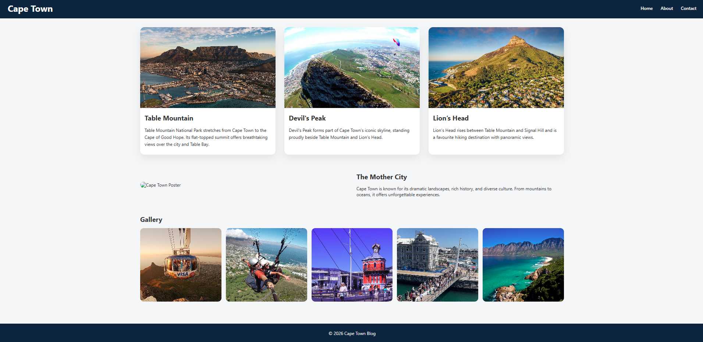

# Cape-Town-Tourist

Tourist Page Blog



Please click here to [view live demo](https://cape-town-tourist.vercel.app/)

---

## Project Overview

**Cape-Town-Tourist** is a blog-style tourist website that provides:

* Information about popular tourist attractions
* Travel tips and recommendations
* Blog posts about places, food, and experiences
* A clean and user-friendly layout for easy navigation

This project is ideal as:

* A portfolio website
* A beginner-to-intermediate web development project
* A foundation for a full tourism platform

---

## Features

* Hero section with clear call-to-action
* Highlight cards for Cape Town landmarks
* Quick facts section for travel inspiration
* Image-based gallery of attractions
* Responsive design (mobile-friendly)
* Simple and modern UI

---

## Built With

* **HTML5** – Page structure
* **CSS3** – Styling and layout
* **JavaScript** – Interactivity (optional/extendable)

---

## Project Structure

```text
Cape-Town-Tourist/
│
├── index.html
├── stylesheet.css
├── Screenshot.png
├── LICENSE
└── README.md
```

---

## Getting Started

1. Clone the repository:

   ```bash
   git clone https://github.com/your-username/Cape-Town-Tourist.git
   ```
2. Open the project folder
3. Run `index.html` in your browser

No additional setup is required.

---

## Future Improvements

* Integrate Google Maps for locations
* Add search and filter functionality
* Include booking or contact forms
* Convert to React or another frontend framework

---

## Contributing

Contributions are welcome!
Feel free to fork this repository, make improvements, and submit a pull request.

---

## License

This project is open-source and available under the **MIT License**.

---

## Credits

All images and content should be used for educational or demo purposes unless otherwise stated.

---

**Explore Cape Town. Experience the Mother City.**
